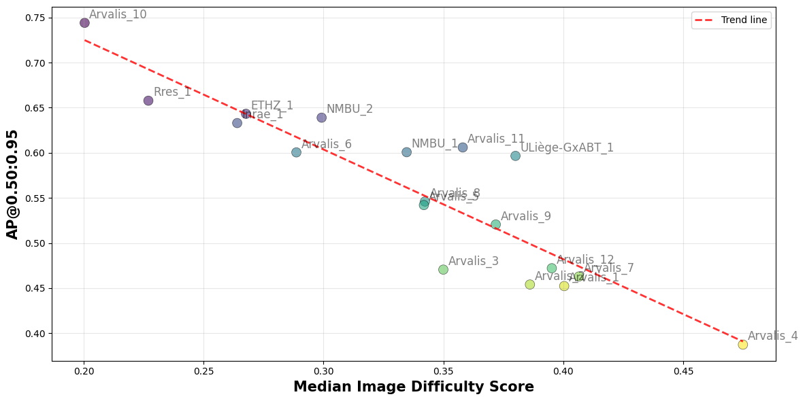
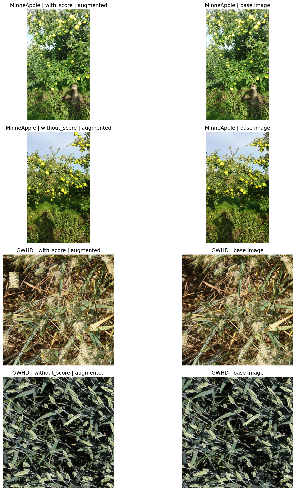
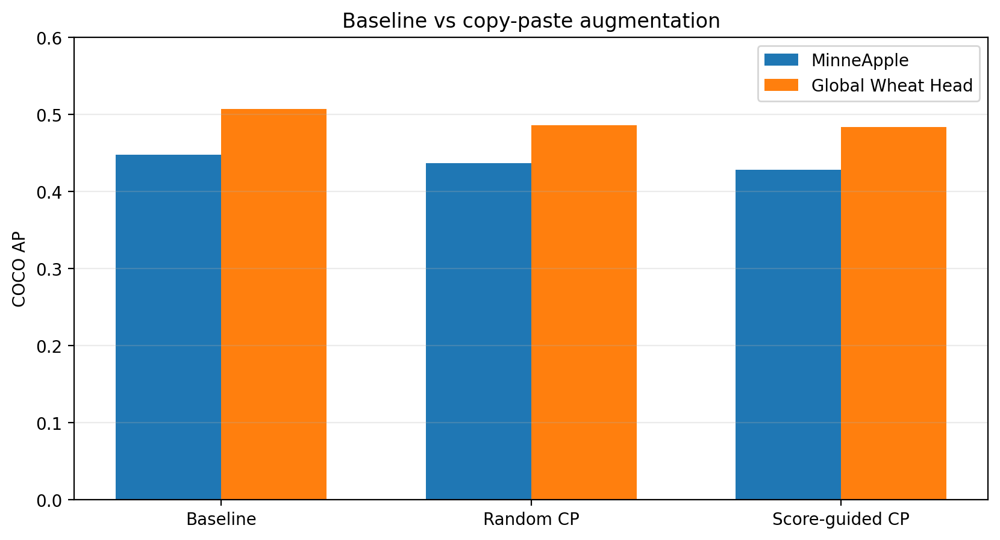

# DifficultyAgri

MIS-based diagnostics for agricultural object detection, with controlled copy-paste augmentation experiments across MinneApple, GWHD 2021, and WGISD.

## What This Project Does

This repository studies a practical question:

Can we predict in advance when copy-paste augmentation will help object detection, and when it will fail?

The core idea is **MIS (MinImageScorer)**, a scoring method that ranks object/image difficulty from baseline detector behavior (misses, localization quality, and false positives).

## Key Findings (Current)

- MIS correlates well with real detection failure signals.
- On structurally hard regimes (sub-resolution objects or strong domain shift), copy-paste is often ineffective or harmful.
- On datasets without those bottlenecks, copy-paste can still provide gains.

### Reported Quantitative Highlights

- Image-level correlation between MIS and miss-rate:
	- MinneApple: `r = 0.66`
	- GWHD: `r = 0.75`
	- WGISD: `r = 0.63`
- MinneApple size-level validity:
	- Spearman between object difficulty and AP-by-size rank: `r_s = -0.82`
	- Top difficulty tertile is dominated by Very Small objects (`64.4%`, AP `0.071`)
- GWHD domain-level validity:
	- Domain AP vs median difficulty anticorrelation: `r = -0.90`
	- Top-20% hard images show near-zero-AP object enrichment (`1.34x`, `p < 0.001`)

Source: `docs/Analyze/main_v2.tex` and generated experiment artifacts under `results/`.

## Important Figures

### 1) GWHD domain difficulty vs AP



Interpretation: domains with higher median MIS generally have lower AP.

### 2) Augmentation comparison summary



Interpretation: copy-paste behavior differs by structural bottleneck type.

### 3) AP comparison bar chart



Interpretation: method ranking should be interpreted together with data regime (size/domain constraints).

## Repository Layout

```text
DifficultyAgri/
	dagri/                  # Core library (data, baseline, scoring, augmentation, utils)
	configs/                # Dataset/experiment YAML configs
	experiments/            # Reproducible experiment entry points
	datasets/               # Dataset roots and formats
	notebooks/              # Analysis and reflection notebooks
	results/                # Experiment outputs and summaries
	docs/                   # Papers, reports, and figures
	tests/                  # Test files
```

## Setup

### Requirements

- Python `>= 3.13`
- Key packages: `torch`, `torchvision`, `ultralytics`, `pycocotools`, `matplotlib`, `seaborn`, `scikit-learn`

### Install

```bash
python3 -m venv venv
source venv/bin/activate
pip install -U pip
pip install -e .
```

If editable install is not desired:

```bash
pip install .
```

## Quick Reproducibility Commands

Run from repository root.

### 1) Baseline training only

```bash
python experiments/01_only_training.py
```

### 2) Scoring only (using trained baseline artifacts)

```bash
python experiments/02_only_scoring.py
```

### 3) Train + scoring pipeline

```bash
python experiments/03_train_and_scoring.py
```

### 4) Multi-seed copy-paste experiment (example)

```bash
python experiments/055_multiseed_copy_paste_exp.py --seeds 123,456,789
```

## Main Outputs to Check

- `results/*/Step_2_Train_and_Evaluate_BASELINE_MODEL/evaluation_results.json`
- `results/*/Step_3_Scoring_Dataset/score_results.json`
- `results/*/summary_augmentation_comparison.json`
- `docs/Analyze/main_v2.pdf`
- `docs/GCCE_2026/*.pdf`

## GCCE 2026 Notes

From the GCCE 2026 submission policy:

- Review manuscript length is 2 pages.
- Use an A4-sized IEEE template.
- Author list/order restrictions apply after the review deadline.

Prepared files in this repo include:

- `docs/GCCE_2026/MinImageScorer_GCCE2026_submission.tex`
- `docs/GCCE_2026/gwhd_domain_score_satisfied.png` (RGB, 300 DPI, single-column-ready width)

## Suggested Reading Order

1. `docs/Analyze/main_v2.pdf`
2. `docs/GCCE_2026/main_v7.pdf`
3. `notebooks/gwhd_2021_score_ap_size_inspection.ipynb`
